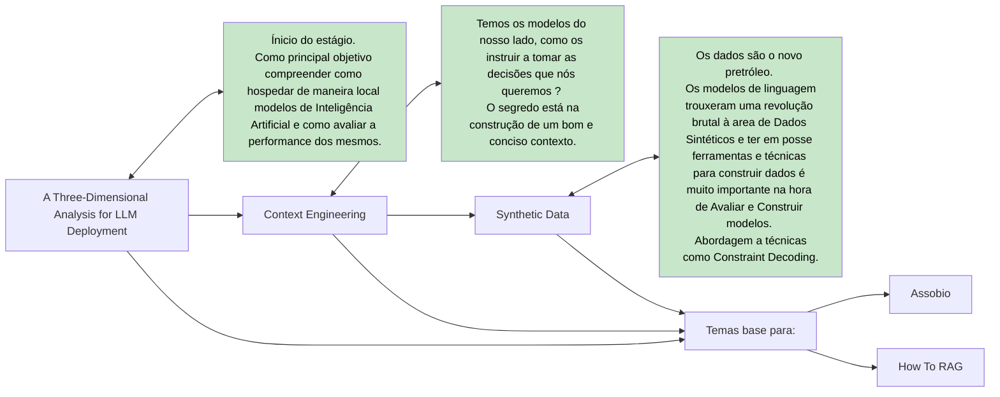

<h1> <a href = "https://github.com/Eliezer-Carvalho/IP/blob/master/A%20Three-Dimensional%20Analysis%20for%20LLM%20Deployment/A%20Three-Dimensional%20Analysis%20for%20LLM%20Deployment.pdf"> A Three-Dimensional Analysis for LLM Deployment </a> </h1>

Apresento uma abordagem para a análise da hospedagem de Large Language Models.

<h1> <a href = "https://github.com/Eliezer-Carvalho/IP/blob/master/Context%20Engineering/Context%20Engineering.pdf"> Context Engineering </a> </h1>

Como fornecer um bom contexto a um modelo ? Porque devemos ter atenção ao contexto ? 

<h1> <a href = "https://github.com/Eliezer-Carvalho/IP/blob/master/Synthetic%20Data/Synthetic%20Data.pdf"> Synthetic Data </a> </h1>

Os dados são o novo petróleo, saber criá-los é muito importante.

<h1> <a href = "https://github.com/Eliezer-Carvalho/IP/blob/master/How%20To%20RAG/How%20To%20RAG.pdf"> How To RAG </a> </h1>

RAG e as suas abordagens. Porque é importante e técnicas de implementação.

<h1> <a href = "https://github.com/Eliezer-Carvalho/IP/blob/master/Automatic%20Speech%20Recognition/Automatic%20Speech%20Recognition.pdf"> Automatic Speech Recognition </a> </h1>

Análise e estudo de modelos ASR. Construção do sistema <b> <a href = "https://github.com/Eliezer-Carvalho/IP/tree/master/Automatic%20Speech%20Recognition/v1"> Assobio</b></a>. 

<h1> TL:DR </h1>

<h1> Links Interessantes </h1>

https://huggingnews.com/  
https://paperswithcode.co/  
https://www.openresearch.sh/compute  
https://deepwiki.com/  
https://www.tensortonic.com/  
https://www.deep-ml.com/projects 
